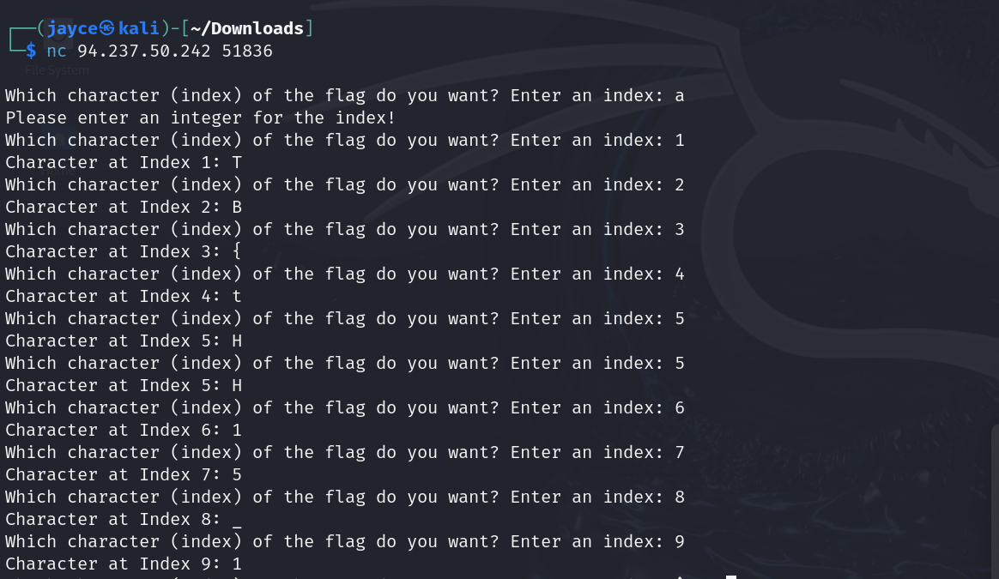
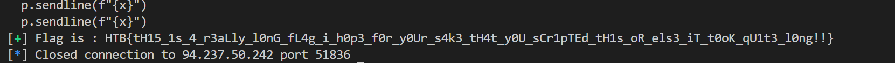

- nc tới địa chỉ ip của thử thách, lần này đề yêu cầu nhập vào 1 số (interger), say đó sẽ trả về 1 ký tự (character).
    
- Sử dụng thư viện py-pwn để code payload: [solve.py](solve.py)
- Flag
    