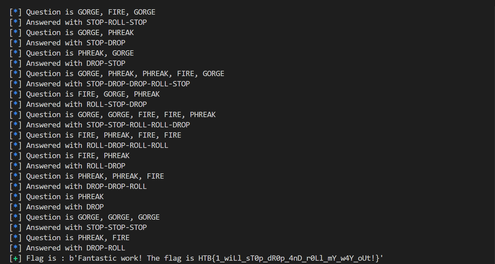

- Thử thách yêu cầu chơi trò chơi giữa GORGE, FIRE, và PHREAK (Tương tự trò kéo búa bao :v) - ánh xạ tương đương với STOP, ROLL, DROP
- Đầu vào sẽ là một chuỗi các từ (có thể trùng lặp) trong số 3 từ trên.
- Yêu cầu thỏa mãn điều kiện là nhập vào chuỗi theo ánh xạ ban đầu, được ngăn cách bằng dấu `-`
- Code payload [solve.py](solve.py)
- Flag
    