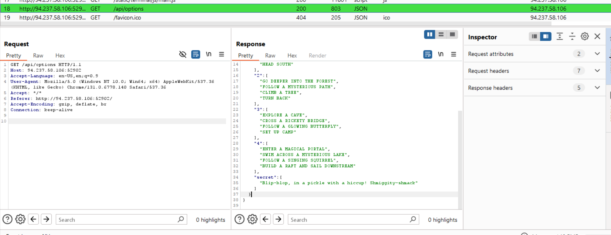
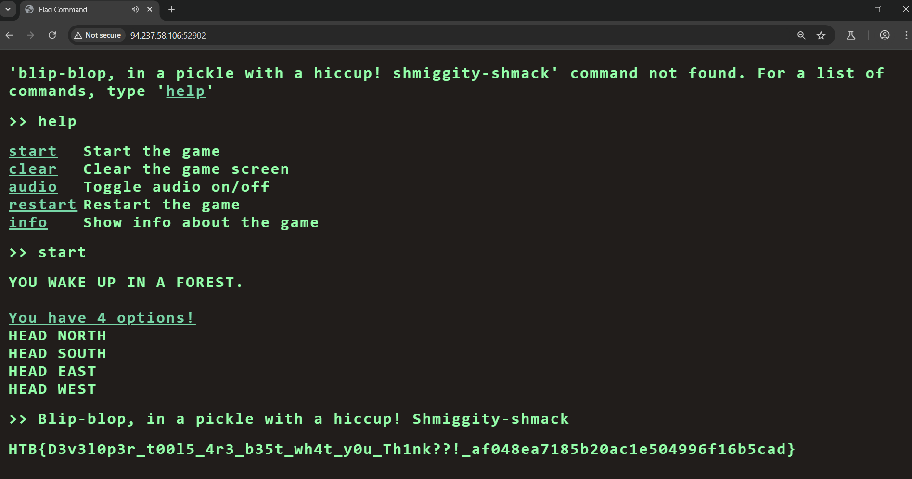

- Sử dụng burpsuite tìm được end point trỏ đến `/api/options` cho phép nhập vào các lựa chọn

    

- Nghi ngờ 1 option có tên:
    `"secret": [
      "Blip-blop, in a pickle with a hiccup! Shmiggity-shmack"
    ]`
- Thử nhập nó vào và tìm được flag
    